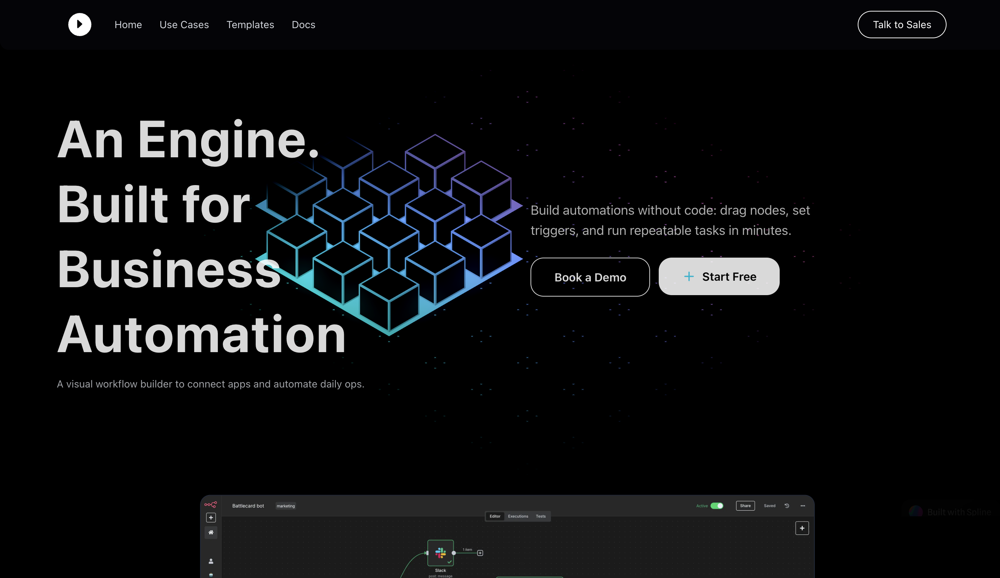

# Neutrons AI

A modern, visual workflow automation platform built with Next.js and React Flow. Automate complex processes by connecting nodes to create powerful workflows with AI, integrations, and custom triggers.



## Features

- **Visual Workflow Builder** - Drag-and-drop interface to design complex automation workflows
- **Node-Based Architecture** - Connect various node types to build sophisticated automation pipelines
  - AI Nodes - Leverage AI for intelligent automation
  - Form Nodes - Collect user input within workflows
  - Trigger Nodes - Stripe, Discord, and Slack integrations
  - Custom Nodes - Extend with custom functionality
- **Real-Time Execution** - Monitor and track workflow execution in real-time
- **Execution History** - View detailed logs and history of all workflow runs
- **Authentication** - Secure user authentication and session management
- **Database Integration** - Powered by Prisma for robust data persistence
- **TypeScript Support** - Full type safety across the application

## Installation

### Prerequisites

- Node.js 18+
- npm, yarn, or pnpm package manager

### Setup

1. **Clone the repository**

```bash
git clone <repository-url>
cd neutrons-ai
```

2. **Install dependencies**

```bash
npm install
# or
yarn install
# or
pnpm install
```

3. **Set up environment variables**
   Create a `.env.local` file in the root directory with your configuration:

```bash
# Database
DATABASE_URL="your_database_url"

# API Configuration
API_URL="http://localhost:3000"

# Other configurations
# Add your environment variables here
```

4. **Set up the database**

```bash
npx prisma migrate dev
```

5. **Run the development server**

```bash
npm run dev
# or
yarn dev
# or
pnpm dev
```

Open [http://localhost:3000](http://localhost:3000) in your browser to see the application.

## Usage

1. **Create a new workflow** - Start by creating a new workflow in the editor
2. **Add nodes** - Select from the node palette to add nodes to your workflow
3. **Connect nodes** - Draw connections between nodes to define the workflow logic
4. **Configure nodes** - Set up parameters and configurations for each node
5. **Deploy & Execute** - Deploy your workflow and monitor execution in real-time
